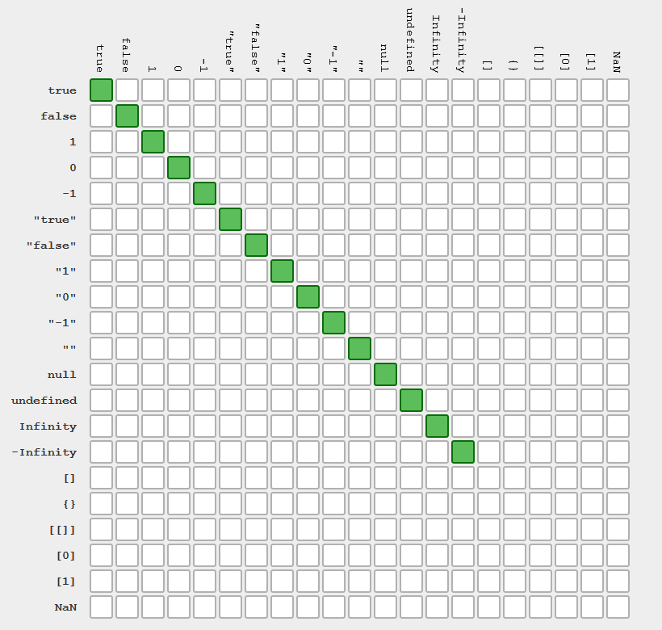
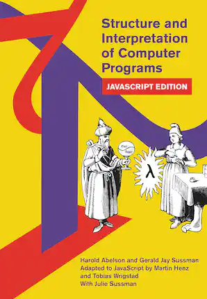

# JavaScript Basics


> **Douglas Crockford:** “JavaScript is the only language (that I'm aware of) where people feel they don't need to learn it before using it.”

## History

- Main influences:
  - Scheme (Functions)
  - Self (Prototypes)
  - Java (Syntax)
  - Perl (Regex)
- Initial version “Mocha”
  - written during 10 days in May 1995
  - by Brandan Eich @ Netscape

```
         Mocha
          LiveScript
           JavaScript
           | (JScript)
           |  |   ES1 ES2  ES3                                     ES5                    ES6
           |  |   |   |    |                                       |                      |
+---+---+---+---+---+---+---+---+---+---+---+---+---+---+---+---+---+---+---+---+---+---+---
93  94  95  96  97  98  99  00  01  02  03  04  05  06  07  08  09  10  11  12  13  14  15
  |   |   |             |       |         |   | |     |       |   |               |       |
  |   |   Internet      |       JSON      |   | Ajax  jQuery  |   Node.js     Electron.js |
  |   |   Explorer      XMLHTTP           |   |               |                           |
  |   |                                   |   Mozilla         Google                      Microsoft
  |   Netscape                            |   Firefox         Chrome                      Edge
  |   Navigator                           |
  |                                       Apple
  Mosaic                                  Safari
```

- Yearly releases since ECMAScript 2016 (ES7)

## Platforms

 ```html
<!DOCTYPE html>
<html>
<head>
<meta charset="UTF-8">
<link rel="stylesheet" href="pretty.css">
<script defer src="bundle.js"></script>
</head>
<body>

<div style="display: flex">
    <textarea id="output" style="flex: 0px" rows="50"></textarea>
</div>

</body>
<script>

// ...
let response = await fetch("https://raw.githubusercontent.com/frectures/js/master/README.md");
let text     = await response.text();

document.getElementById("output").value = text;
// ...

</script>
</html>
```

- Browser (frontend)
  - HTML (*H*yper*T*ext *M*arkup *L*anguage)
  - CSS (*C*ascading *S*tyle *S*heets)
  - JS (*J*ava*S*cript)
  - DOM (*D*ocument *O*bject *M*odel)
- Node.js (backend)
  - JavaScript runtime environment built on Chrome's V8 JavaScript engine
  - High-performance, asynchronous server code
- Electron.js = Chromium + Node.js (cross-platform desktop applications)
  - Atom
  - Discord
  - Microsoft Teams
  - Skype
  - Visual Studio Code

## Type system

- Dynamically typed
- Primitive types
  1. `boolean`
     - `false`
     - `true`
  2. `number` (double precision floating point)
     - `0.1 + 0.2 === 0.30000000000000004`
     - `1.0 + 2.0 === 3.0`
     - Contains all integers up to 2<sup>53</sup> = `9_007_199_254_740_992`
  3. `bigint` (arbitrary precision integer)
     - `123n`
     - `BigInt(456)`
  4. `string` (UTF-16)
     - `"Ain't no sunshine"`
     - `'The cow says: "Moo"'`
     - `` `Frantic fans: "It's great!"` ``
     - `"🤨".length === 2`
       - UTF-16: `55358, 56616` (Java, C#, JavaScript)
       - UTF-8: `240, 159, 164, 168` (Go, Rust, Swift)
  5. `undefined` (mostly bugs)
     - uninitialized variables
     - function calls without return value
     - missing function arguments
     - missing object properties
     - array index out of bounds
  6. `null` (intentional absence)
- Reference types
  - `Object`
    - `Function`
    - `Array`
    - ...

> **Exercise:**
> - Evaluate the following expressions in the browser console (F12)
> - Which results do you find surprising?

```js
typeof false
typeof 3.14
typeof 123n
typeof "hello"
typeof "hello"[0]
typeof undefined
typeof null
typeof {}
typeof Math.log
typeof []
```


> **Martin Fowler:** “Choosing JavaScript was deeply ironic for me, as many readers may know, I'm not a fan of it.
> It has too many awkward edge cases and clunky idioms.
> But the compelling reason for choosing it over Java is that JavaScript isn't wholly centered on classes.
> There are top-level functions, and use of first-class functions is common.
> This makes it much easier to show refactoring out of the context of classes.”

## Variables

- `var` variables have function scope:

```js
function f() {
    console.log(x); // undefined
    {
        console.log(x); // undefined

        var x = 42;

        console.log(x); // 42
    }
    console.log(x); // 42
}                   
```

- `let` variables have block scope:

```js
function f() {
    console.log(x); // ReferenceError: x is not defined
    {
        console.log(x); // ReferenceError: x is not defined

        let x = 42;

        console.log(x); // 42
    }
    console.log(x); // ReferenceError: x is not defined
}                   
```

- `const` requires initialization and forbids mutation of the variable:

```js
function f() {
    const uninitialized;     // SyntaxError: Missing initializer in const declaration

    const x = 42;
    x = 97;                  //   TypeError: Assignment to constant variable

    const account = new Account();
    account.deposit(42);     //        okay: mutates referenced object, not account variable

    account = new Account(); //   TypeError: Assignment to constant variable
}
```

## [Equality](https://stackoverflow.com/a/23465314)

- Type-safe equality via `===` and `!==` (compares type and value)



- Type-unsafe equality via `==` and `!=` (confusing type coercions)


- There is no universal `equals` method for object equality

## Control flow

```js
function releaseYearOfEcmaScript(version) {
    if (version < 1) throw new Error(`non-positive ECMAScript version ${version}`);
    //               /////
    switch (version) {
    //////
        case 1: return 1997;
        case 2: return 1998;
        case 3: return 1999;
        case 4: throw new Error("abandoned ECMAScript version 4");
        case 5: return 2009;

        default: return (version >= 2015) ? version : 2009 + version;
    }            //////                  ///       ///
}
```

> **Exercise:**
> - `releaseYearOfEcmaScript` handles some illegal inputs (such as 0 and 4)
> - Can you think of more illegal inputs to `releaseYearOfEcmaScript`?
> - Handle those illegal inputs as you see fit

### truthy/falsy values

- Technically, conditions are not restricted to `boolean` values:

```js
function f(value) {
    if (value) {
        return "truthy";
    } else {
        return "falsy";
    }
}

f(42)  // truthy
f( 0)  // falsy
f("0") // truthy
f("")  // falsy
```

- The following equivalent function explicitly lists all falsy values:

```js
function g(value) {
    const falsyValues = [ false, NaN, 0, -0, 0n, "", undefined, null ];

    return falsyValues.includes(value) ? "falsy" : "truthy";
}
```

- For the sake of maintenance, prefer `boolean` values in conditions

> **Exercise:**
> - Replace the array in function `g` with a `switch`
> - Is `g` still equivalent to `f`? Try all falsy values!

### Loops

```js
for (let i = 0; i < s.length; ++i) {
    console.log(s[i]);
}


let x = 1;
while (x + 1 > x) {
    x *= 2;
}
console.log(`${x} is the smallest integer without odd successor`);


let password;
do {
    password = readPassword();
} while (password !== "Simsalabim");
```

> **Exercise:**
> 1. Write a `for` loop that logs all divisors of `42`
>    - Hint: `dividend % divisor === rest`
> 2. Start with `x = 27` and write a `while` loop that logs `x` and transforms it once per iteration:
>    - If `x` is even, divide `x` by 2
>    - If `x` is odd, multiply `x` by 3 and increment
>    - Stop the loop when `x` reaches 1

## Functions



```js
function average1(x, y) {
    return (x + y) / 2;
}

const average2 = function (x, y) {
    return (x + y) / 2;
};
```

- `function average1` does not prevent accidental reassignment: `average1 = "😱";`
- `const average2 = function` cannot be called above its definition
- Missing arguments are initialized to `undefined`
- Extra arguments are ignored
- Implicit `return undefined;` at the bottom

> **Exercise:** Write a function `isPerfectNumber(x)`
> - The divisors of a perfect number add up to twice that number
> - The first 4 perfect numbers are 6, 28, 496 and 8128

### Higher-order functions

- Can we extract the essence of `fixCos` and `fixSqrt` into one `fix` function?

<table>
<tr>
<th>fixCos</th>
<th>fixSqrt</th>
</tr>
<tr>
<td>

```js
function fixCos() {
    let x = 0.0;

    do {
        // 0
        // 1
        // 0.5403023058681397
        console.log(x);
        // 0.7390851332151608
        // 0.7390851332151606
        // 0.7390851332151607
    } while (x !== (x = Math.cos(x)));

    return x;
}

fixCos();
```

</td>
<td>

```js
function fixSqrt() {
    let x = 0.5;

    do {
        // 0.5
        // 0.7071067811865476
        // 0.8408964152537146
        console.log(x);
        // 0.9999999999999997
        // 0.9999999999999998
        // 0.9999999999999999
    } while (x !== (x = Math.sqrt(x)));

    return x;
}

fixSqrt();
```

</td>
</tr>
</table>

- Yes, by abstracting over `f` and `x`:

```js
function fix(f, x) {
    do {
        console.log(x);
    } while (x !== (x = f(x)));

    return x;
}

fix(Math.cos, 0.0);

fix(Math.sqrt, 0.5);

fix(function (x) { return x/2; }, 1.0);
```

### Arrow functions

```js
fix((x) => x/2, 1.0);

fix( x  => x/2, 1.0);
```

- JavaScript hipsters prefer arrow functions everywhere:

```js
const average3 = (x, y) => (x + y) / 2;
```


## Objects

- In practice, you will encounter two “kinds” of objects:
  1. Object literals / JSON (*J*ava*S*cript *O*bject *N*otation)
  2. Class objects
- Technically, there is only 1 kind of object, but the whole truth is quite complicated

### Object literals / JSON

- A JavaScript object is essentially a `java.util.LinkedHashMap<String, Object>`

```js
// Object literal
const inventor = { forename: "Brandon", surename: "Eich" };

// read properties
inventor.forename    // 'Brandon'
inventor["surename"] // 'Eich'

// write properties
inventor.forename = "Brendan"; // { forename: 'Brendan', surename: 'Eich' }
inventor["year"]  =  1961;     // { forename: 'Brendan', surename: 'Eich', year: 1961 }

// delete properties
delete inventor.forename;      // { surename: 'Eich', year: 1961 }

// JSON
const str  = JSON.stringify(inventor); // '{"surename":"Eich","year":1961}'
const twin = JSON.parse(str);          //  { surename: 'Eich', year: 1961 }
```

- Quotation marks around keys are:
  - optional in literals
  - mandatory in JSON

### Class objects

```js
class Account {
    static instanceCounter = 0;

    constructor(initialBalance, accountId) {
        this.balance = initialBalance;
        this.id = accountId;
        Account.instanceCounter += 1;
    }

    deposit(amount) {
        this.balance += amount;
    }

    getBalance() {
        return this.balance;
    }
}

const account = new Account(1000, 42);

account.deposit(234);
account.getBalance() // 1234
```

### Syntax sugar

> Even though ECMAScript includes syntax for class definitions,
> **[ECMAScript objects](https://tc39.es/ecma262/#sec-objects) are not fundamentally class-based**
> such as those in C++, Smalltalk, or Java

- The `class Account` example desugars to:

```js
function Account(initialBalance, accountId) {
    this.balance = initialBalance;
    this.id = accountId;
    Account.instanceCounter += 1;
}

Account.instanceCounter = 0;

Account.prototype.deposit = function (amount) {
    this.balance += amount;
};

Account.prototype.getBalance = function () {
    return this.balance;
};
```

- Key points to remember:
  - `new T()` objects store fields
  - `T.prototype` object stores methods
  - `new T().__proto__ === T.prototype`
  - `T` object stores static fields
- Less rigid than the `class` keyword may suggest:

```js
const account = new Account(1000, 42);

// add field to object
account.audited = true;

// delete field from object
delete account.id;

// deactivate method for object
account.deposit = undefined;

// delete method from class
delete Account.prototype.deposit;

// change an object's class after creation
account.__proto__ = SavingsAccount.prototype;
```

### Dynamic maps

> **Exercise:**
> - Study the “Object literals / JSON” example again
> - Then complete the function `countWords`:

```js
function countWords(str) {
    // TODO create empty object
    for (const word of str.match(/\w+/g)) {
        // TODO increment value of key word in object
    }
    // TODO return object
}

countWords("Wenn hinter Fliegen Fliegen fliegen, fliegen Fliegen Fliegen nach.")
// { Wenn: 1, hinter: 1, Fliegen: 4, fliegen: 2, nach: 1 }

countWords("The constructor does not CREATE objects; The constructor INITIALIZES objects!")
// Do you notice something weird?

countWords("Most JavaScript objects have a special __proto__ property related to inheritance.")
// Do you notice something weird?
```

> **Exercise:**
> - Apparently, object literals `{}` have pitfalls for dynamic keys
> - Replace the object literal `{}` with a [`new Map()`](https://www.w3schools.com/js/js_object_maps.asp) (ES2015)
>   - pertinent methods: `has`, `get`, `set`


## Arrays

```js
const primes = [2, 3, 5, 7];
typeof primes                      // 'object'
Object.getOwnPropertyNames(primes) // [ '0', '1', '2', '3', 'length' ]

primes.length // 4
primes[0]     // 2
primes[4]     // undefined

primes[4] = 11;      // [ 2, 3, 5, 7, 11 ]
primes.push(13);     // [ 2, 3, 5, 7, 11, 13 ]
primes.push(17, 19); // [ 2, 3, 5, 7, 11, 13, 17, 19 ]
primes[24] = 97;     // [ 2, 3, 5, 7, 11, 13, 17, 19, <16 empty items>, 97 ]
primes.length = 5;   // [ 2, 3, 5, 7, 11 ]
primes.pop();        // [ 2, 3, 5, 7 ]
```

- JavaScript arrays are JavaScript objects with a special `length` property
  - The keys are stringified numbers
- The (mutable!) `length` property is the largest index +1
- There are no “array index out of bounds” errors:
  - Reading from such an index gives `undefined`
  - Writing to such an index grows the array

> **Exercise:** Write a function `divisors(x)` that returns an array containing all divisors of `x`

### Iteration

```js
for (let i = 0; i < primes.length; ++i) {
    console.log(primes[i]);
}

for (const value of primes) {
                 // 2, 3, 5, 7
    console.log(value);
}

for (const index in primes) {
                 // '0', '1', '2', '3'
    console.log(index);
}

primes.forEach(function (value, index, array) {
    array[index] = -value;
});
```

### Sorting

```js
// sort by toString() value
primes.sort();
// [ 11, 13, 17, 19, 2, 3, 5, 7 ]

// sort by numeric value
primes.sort((a, b) => a - b);
// [ 2, 3, 5, 7, 11, 13, 17, 19 ]
```

### Functional

```js
const people = [
    { forename: "Alan",   surename: "Turing",     year: 1912 },
    { forename: "Alan",   surename: "Kay",        year: 1940 },
    { forename: "Bjarne", surename: "Stroustrup", year: 1950 },
    { forename: "Brian",  surename: "Kernighan",  year: 1942 },
    { forename: "Dennis", surename: "Ritchie",    year: 1941 },
    { forename: "James",  surename: "Gosling",    year: 1955 },
];

const whippersnappers  = people.filter(person => person.year >= 1950);

const years            = people.map(person => person.year);
                      // [ 1912, 1940, 1950, 1942, 1941, 1955 ]

const yearSum          = people.reduce((sumSoFar, person) => sumSoFar + person.year,  0);
                      // 0 + 1912 + 1940 + 1950 + 1942 + 1941 + 1955

const sortedByYear     = people.toSorted((a, b) => a.year - b.year);

const sortedBySurename = people.toSorted((a, b) => a.surename.localeCompare(b.surename));
```

> **Exercise:** Simplify the function `isPerfectNumber(x)` with the previous function `divisors` and the `reduce` method

## Modules

- One `.js` file per module
- Explicit `export`s and `import`s
- In theory, browsers support modules via `<script type="module" src="mod.js">` (implicit `defer`)
  - ⚠️ requires web server; can't just “double-click on `index.html`”
- In practice, modules are usually bundled into a single `bundle.js` file by module bundlers like Webpack

### Named exports

```js
// trig.js

export const PI = 3.141592653589793;
const RADIANS_PER_DEGREE = PI / 180; // not exported

export function radians(degrees) {
    return degrees * RADIANS_PER_DEGREE;
}

export function degrees(radians) {
    return radians / RADIANS_PER_DEGREE;
}

export function distance(x, y) {
    return Math.sqrt(square(x) + square(y));
}

// not exported
function square(x) {
    return x * x;
}
```

### Named imports

```js
// app.js

import { PI, distance as distanceFromOrigin } from './trig';

const distance = 1.5;

console.log(PI);
console.log(distanceFromOrigin(3, 4));
```

### Namespace import

```js
// app.js

import * as trig from './trig';

const distance = 1.5;

console.log(trig.PI);
console.log(trig.distance(3, 4));
```
